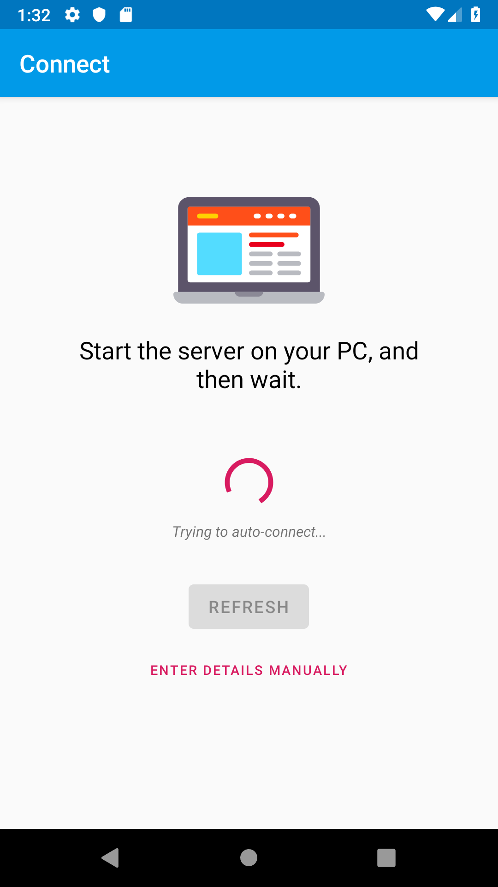
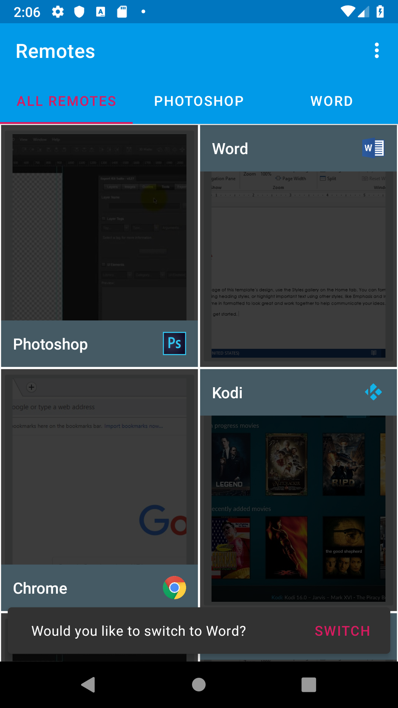
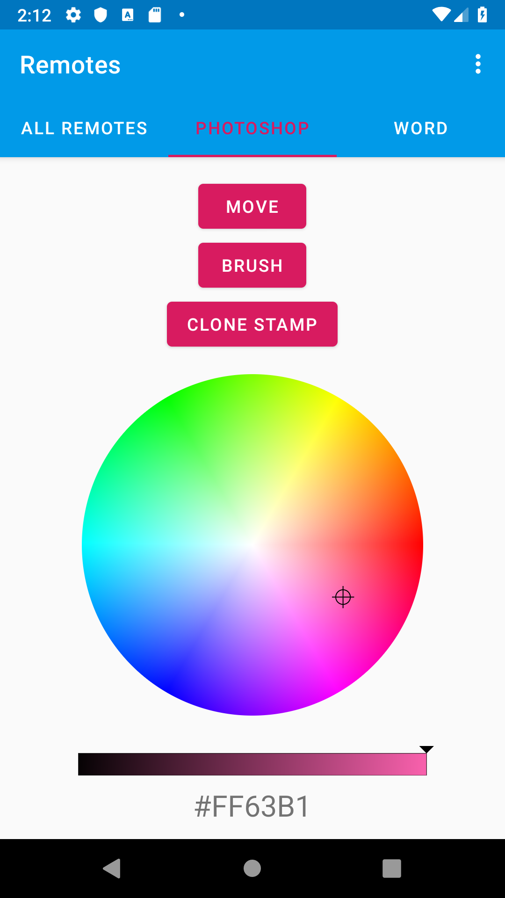

# Dynamote - a Dynamic Remote
A dynamic remote that can control your PC from your Android device.

## Screenshots

## What is it?
Dynamote is a system that uses a PC server and an Android client to control PC applications.
The system is designed to be dynamic, so for example, switching supported PC programs trigger a message to switch remotes on your Android device.

## Requirements
- A PC with _python 2.7_ installed. 
- An Android device with version 4.0.3+.

**_Both devices need to be connected to the same local network (a Wifi hotspot is ok too)._**

## Features
### Auto-Connect
When PC and Android device are connected to the same network, a network discovery is performed and the device should connect automatically to the python server.  
If not, you can switch to the **manual connect** option and connect manually using the details provided by the server.

### PC Updates
When user switches to another supported PC program, the user will be prompted on his android device with the option to switch to the relevant remote.
